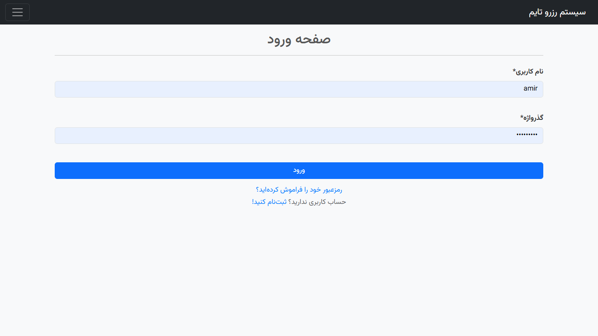
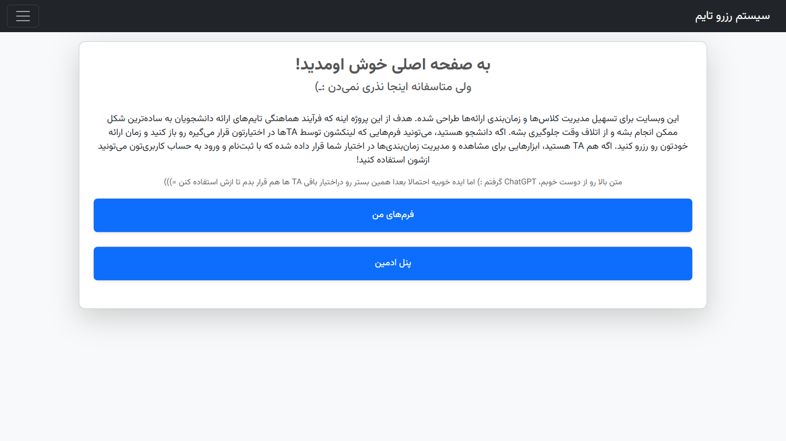

# Django Web Application for Teaching Assistants (TAs)

This open-source Django web application is designed to help Teaching Assistants (TAs) manage their classes efficiently. Whether it's scheduling time slots, tracking reservations, or organizing forms for student submissions, this tool is tailored for educators looking for an intuitive and powerful solution.

[Deployed URL](https://amirkh.pythonanywhere.com/)

---

## Features

- **Dynamic Form Management**: Create and manage forms with associated course details.
- **Time Slot Scheduling**: Define and manage reservation slots for specific classes or events.
- **Student Reservations**: Track which students have reserved specific time slots.
- **Customizable Semesters**: Support for different academic years and semesters.
- **Admin-Friendly**: Easy-to-use interfaces for creating, updating, and managing resources.
- **Responsive Design**: Optimized for both desktop and mobile use.

---

## How TAs Can Use It

Teaching Assistants can use this application to:

1. **Organize Classes**: Create forms linked to specific courses and semesters.
2. **Schedule Meetings**: Define available time slots for one-on-one sessions, group discussions, or lab sessions.
3. **Track Attendance**: Monitor which students have reserved or attended sessions.
4. **Simplify Communication**: Use the platform to keep track of students’ reservations and respond to their needs more effectively.

You can either run the application locally or explore the [deployed version](https://amirkh.pythonanywhere.com/) as shown below.

---

## How to use deployed version?

### Home Page
|  |
|:---------------------------------:| 
| *A welcoming view for all users, showcasing the main features.* |

---

### Sidebar Menu
|  |
|:------------------------------------:| 
| *Quick navigation through the application's core features.* |

---

### Login Page
|  |
|:---------------------------------:| 
| *Secure login with a link to the signup page for new users.* |

---

### Home Page: After Login
|  |
|:---------------------------------------------:| 
| *Personalized dashboard displaying user-specific content.* |

---

### User's Forms
|  |
|:---------------------------------:| 
| *Manage and access all your forms in one place.* |

---

### Create New Form
|  |
|:------------------------------------:| 
| *Effortlessly generate a new form tailored to your needs.* |

---

### Form Details
|  |
|:-------------------------------------:| 
| *Detailed view of a specific form, including its metadata.* |

---

### Form's Answers
|  |
|:--------------------------------------:| 
| *Browse all responses submitted to your form.* |

---

### Add Scripted Timeslots
|  |
|:----------------------------------------:| 
| *Easily schedule multiple time slots in one go.* |

---

### Add Single Timeslot
|  |
|:-----------------------------------------:| 
| *Add a single, precise time slot with flexibility.* |

---

### Booking Timeslot (User)
|  |
|:------------------------------------------:| 
| *Allow students to book available time slots effortlessly.* |

---

### Updating User Information
|  |
|:---------------------------------------------------:| 
| *Keep your account details up-to-date with ease.* |

---

### Change Password (While Logged In)
|  |
|:-------------------------------------:| 
| *Enhance security by updating your password.* |


---

## Getting Started

Follow these steps to clone and run the project locally:

### Prerequisites

- Python 3.8+
- Django 4.0+
- SQLite (default) or PostgreSQL for production use
- Git

### Installation

1. **Clone the Repository**:

   ```bash
   git clone https://github.com/amirkhgraphic/MyOnlineForm.git
   cd MyOnlineForm
   ```

2. **Create and Activate a Virtual Environment**:

   ```bash
   python -m venv env
   source env/bin/activate  # On Windows: env\Scripts\activate
   ```

3. **Install Dependencies**:

   ```bash
   pip install -r requirements.txt
   ```

4. **Set Up the Database**:

   ```bash
   python manage.py migrate
   ```

5. **Create a Superuser**:

   ```bash
   python manage.py createsuperuser
   ```

6. **Run the Development Server**:

   ```bash
   python manage.py runserver
   ```

7. **Access the Application**:

   Open your browser and navigate to `http://127.0.0.1:8000/`.

---

## Project Structure

- **`forms/`**: Handles form creation and management.
- **`core/`**: Manages setting and configurations of WSGI & ASGI application.
- **`templates/`**: Contains HTML templates for frontend rendering.
- **`static/`**: Includes static files (CSS, JS, etc.).
- **`users/`**: User management and authentication logic.

---


## Endpoints

### Core

- `/admin/`: Django admin panel.
- `/form/`: Includes all form-related functionality (detailed below).
- `/user/`: Includes all user authentication and profile-related functionality (detailed below).
- `/`: Home page (static template).

### Form App

- `/form/`: View all forms (`FormListView`).
- `/form/create/`: Create a new form (`FormCreateView`).
- `/form/<slug:slug>/`: View form details (`FormDetailView`).
- `/form/<slug:slug>/update/`: Update an existing form (`FormUpdateView`).
- `/form/<slug:slug>/time/<int:pk>/`: Book a specific time slot (`BookTimeSlotView`).
- `/form/<slug:slug>/answers/`: View all booked time slots for a form (`BookedTimeSlotsView`).
- `/form/<slug:slug>/success/`: Booking success page (`SuccessView`).
- `/form/delete-time-slot/<int:pk>/`: Delete a specific time slot answer (`AnswerDeleteView`).
- `/form/add-timeslot/<int:form_id>/`: Add a single time slot (`TimeSlotCreateView`).
- `/form/add-timeslots/<int:form_id>/`: Add multiple time slots (`TimeSlotsCreateView`).
- `/form/<slug:slug>/time-slot/delete/<int:pk>/`: Delete a time slot (`TimeSlotDeleteView`).

### Users App

- `/user/signup/`: User signup (`UserSignUpView`).
- `/user/login/`: User login (`UserLoginView`).
- `/user/logout/`: User logout.
- `/user/profile/`: Update user profile (`UpdateProfileView`).
- `/user/password_change/`: Change password.
- `/user/password_change/done/`: Password change complete.
- ~~`/user/password_reset/`: Initiate password reset.~~ <mark>NOT IMPLEMENTED</mark>
- ~~`/user/password_reset/done/`: Password reset initiated.~~ <mark>NOT IMPLEMENTED</mark>
- ~~`/user/password_reset/<uidb64>/<token>/`: Confirm password reset.~~ <mark>NOT IMPLEMENTED</mark>
- ~~`/user/password_reset/complete/`: Password reset complete.~~ <mark>NOT IMPLEMENTED</mark>

---

## Contribution Guidelines

We welcome contributions to enhance this project! Here’s how you can help:

1. Fork the repository.
2. Create a feature branch:

   ```bash
   git checkout -b feature-name
   ```

3. Commit your changes:

   ```bash
   git commit -m "Add a meaningful message"
   ```

4. Push to your branch:

   ```bash
   git push origin feature-name
   ```

5. Open a pull request.

---

## License

This project is licensed under the MIT License. Feel free to use, modify, and distribute it as per the license terms.

---

## Feedback and Support

If you encounter any issues or have suggestions for improvements, feel free to open an issue in the repository or contact the project maintainers.

---

## Acknowledgments

Special thanks to all the TAs and educators whose feedback helped shape this application. Your dedication to teaching and supporting students inspires us to build better tools!

